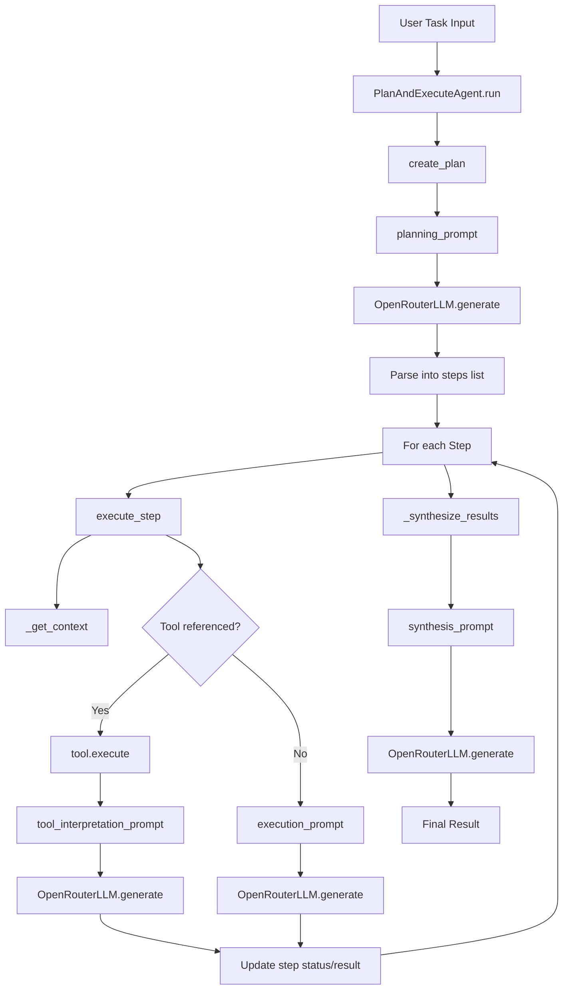
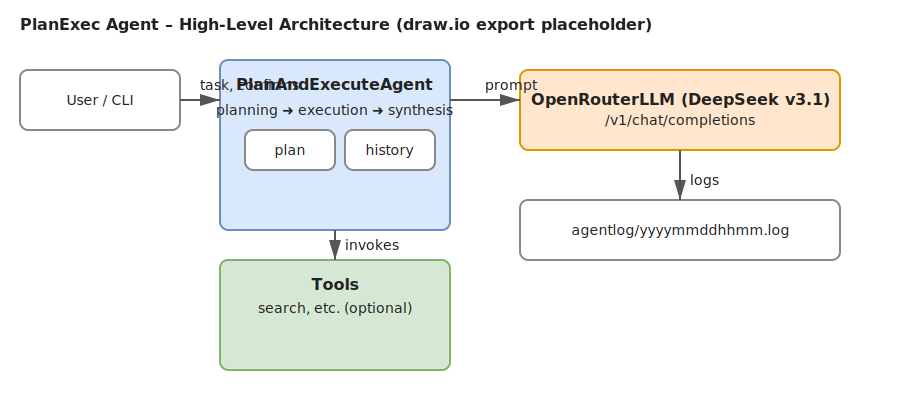

To use this code:

Install [uv](https://docs.astral.sh/uv/) if you do not already have it available. On macOS/Linux you can run:

```bash
curl -LsSf https://astral.sh/uv/install.sh | sh
```

Create the project environment and install dependencies with uv (this writes to `.venv/` by default):

```bash
uv venv
source .venv/bin/activate
uv sync
```

Get your OpenRouter API key from [OpenRouter](https://openrouter.ai/keys)
Create a `.env` file (or copy from `.env.example`) with your key:

```
OPENROUTER_API_KEY=your-api-key-here
```

Note: The app automatically loads environment variables from `.env` using `python-dotenv`.

Run the script:

```bash
uv run python agent.py
```

You can also pass the task on the command line or enter it interactively:

```bash
# Pass task via CLI args
uv run python agent.py "Create a brief guide about Python decorators"

# Or run without args and you'll be prompted to input a task
uv run python agent.py
```
The key components are:

- **OpenRouterLLM**: Handles API calls to DeepSeek v3 through OpenRouter.
- **PlanAndExecuteAgent**: Unified agent that creates plans, executes them step by step, and can optionally use tools.
- **Tool classes**: Extensible framework for adding capabilities (built-in tools cover file I/O, command execution, web search, and HTTP fetching).

The agent will automatically break down any task into steps, execute each step using DeepSeek v3, optionally invoke tools, and synthesize the results into a final output.

## Architecture



Notes:
- Prompts are constructed in `prompts.py` and consumed by `agent.py`.
- API key is read from `.env` via `python-dotenv` (`OPENROUTER_API_KEY`).
- The unified `PlanAndExecuteAgent` invokes registered `Tool`s when their names appear in step descriptions (see `tools.py` for the default tool set).

## Logging

- Each run writes a detailed session log to the `agentlog/` directory next to `agent.py`.
- The log file name is timestamped as `yyyymmddhhmm.log` (e.g., `202509112259.log`).
- Logged details include:
  - Planning prompts and LLM responses.
  - Parsed steps (or fallback plan notice).
  - Execution prompts and LLM responses for each step.
  - Tool selections, tool outputs, and the tool-interpretation prompts and LLM responses.
  - Synthesis prompt and final LLM response.
  - Any errors encountered during planning, execution, or synthesis.

You can open the latest file in `agentlog/` to see the full trace of what the agent did for that session.

## Diagrams (draw.io / diagrams.net)

GitHub does not natively render `.drawio` diagram sources in Markdown. The recommended approach is to:
- Keep the editable source as a `.drawio` file in the repo
- Export to `.svg` (or `.png`) and embed that image in the README

Editable source (for later refinement): `docs/architecture.drawio`

Rendered diagram (exported SVG):



## Design Notes and TODOs

- Chat state is currently stateless per call.
  - `OpenRouterLLM.generate()` posts a single `user` message each time. There is no server-side session ID; prior context is not automatically preserved.
  - Consequence: Step 1 execution does not include the original task/system prompt unless explicitly added to the execution prompt.
  - TODO: introduce a chat-history flow where we resend prior turns on every API call via a `messages` array, including a seed `system` message.

- Keep model prompts in natural language, not JSON.
  - The API envelope is JSON, but the `content` sent to the model should remain plain, well-structured text.
  - Encoding prompts as JSON inside `content` tends to reduce quality and isn’t needed.

- Structured JSON logging for readability.
  - Add `_log_json(event, payload)` to record prompts/responses as one-line JSON records.
  - Log planning prompt/response, execution prompt/response (with `step_id`, `description`, `context`), tool usage, and synthesis prompt/response.
  - Optionally log a redacted request summary before each API call (model, temperature, max_tokens, count of messages) and a response summary (chars, preview).

- Step confirmation and perceived pause.
  - The prompt `Proceed with Step N ... [Y/N]` is read via `input()`; after `Y`, the agent constructs the execution prompt and performs a network call to the LLM.
  - The delay seen after confirming is the API round-trip/model latency; progress is captured in `agentlog/` (confirmation → prompt logged → response logged).

### Implementation Plan (deferred)

1) Add chat-history support
   - Extend `OpenRouterLLM` with `generate_messages(messages, temperature, max_tokens)`.
   - Track `self.chat_history: List[Dict[str,str]]` in `PlanAndExecuteAgent`.
   - Seed a `system` turn at `run()` start; append planning/step prompts as `user` turns and responses as `assistant` turns.

2) JSON structured logging
   - Add `_log_json(event, payload)` beside `_log()` and switch key log points to JSON entries.
   - Do not log secrets (API key). Prefer previews for very long texts.

3) Optional: include task in Step 1 prompt
   - Modify `execution_prompt()` to optionally prepend the original task to the first step’s prompt (config flag), while still relying on chat history for later steps.

4) Optional: tool-observation turns
   - If tools are used, emit an `<observation>`-style `user` message and call `generate_messages()` again to mimic tool-feedback loops.
