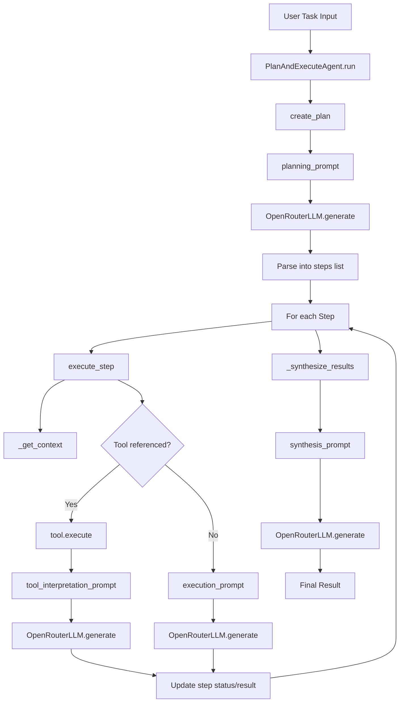

To use this code:

Create and activate a Python virtual environment (recommended):

```bash
# Create a virtual environment in a .venv folder
python3 -m venv .venv

# Activate it (macOS/Linux)
source .venv/bin/activate
```

Install the required packages:

```bash
pip install -r requirements.txt
```

Get your OpenRouter API key from [OpenRouter](https://openrouter.ai/keys)
Create a `.env` file (or copy from `.env.example`) with your key:

```
OPENROUTER_API_KEY=your-api-key-here
```

Note: The app automatically loads environment variables from `.env` using `python-dotenv`.

Run the script:

```bash
python agent.py
```

You can also pass the task on the command line or enter it interactively:

```bash
# Pass task via CLI args
python agent.py "Create a brief guide about Python decorators"

# Or run without args and you'll be prompted to input a task
python agent.py
```
The key components are:

- **OpenRouterLLM**: Handles API calls to DeepSeek v3 through OpenRouter.
- **PlanAndExecuteAgent**: Unified agent that creates plans, executes them step by step, and can optionally use tools.
- **Tool classes**: Extensible framework for adding capabilities (example included: `SearchTool`).

The agent will automatically break down any task into steps, execute each step using DeepSeek v3, optionally invoke tools, and synthesize the results into a final output.

## Architecture



Notes:
- Prompts are constructed in `prompts.py` and consumed by `agent.py`.
- API key is read from `.env` via `python-dotenv` (`OPENROUTER_API_KEY`).
- The unified `PlanAndExecuteAgent` invokes registered `Tool`s when their names appear in step descriptions (example tool: `SearchTool`).
